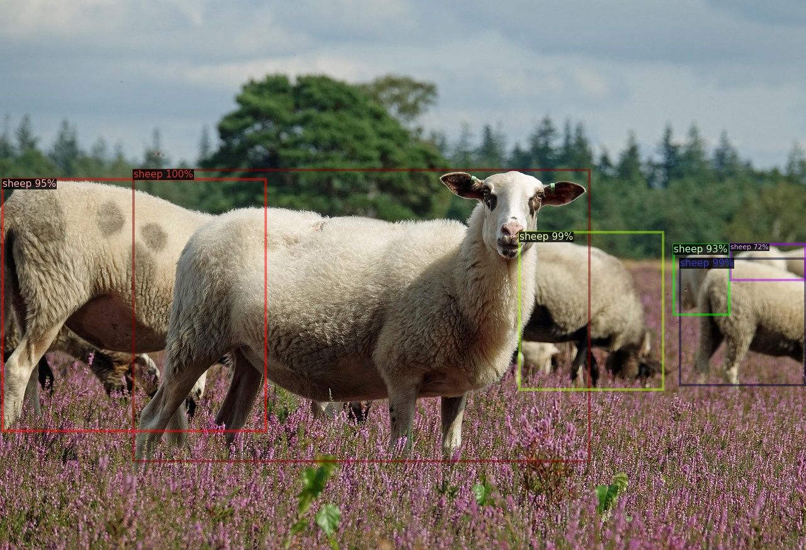
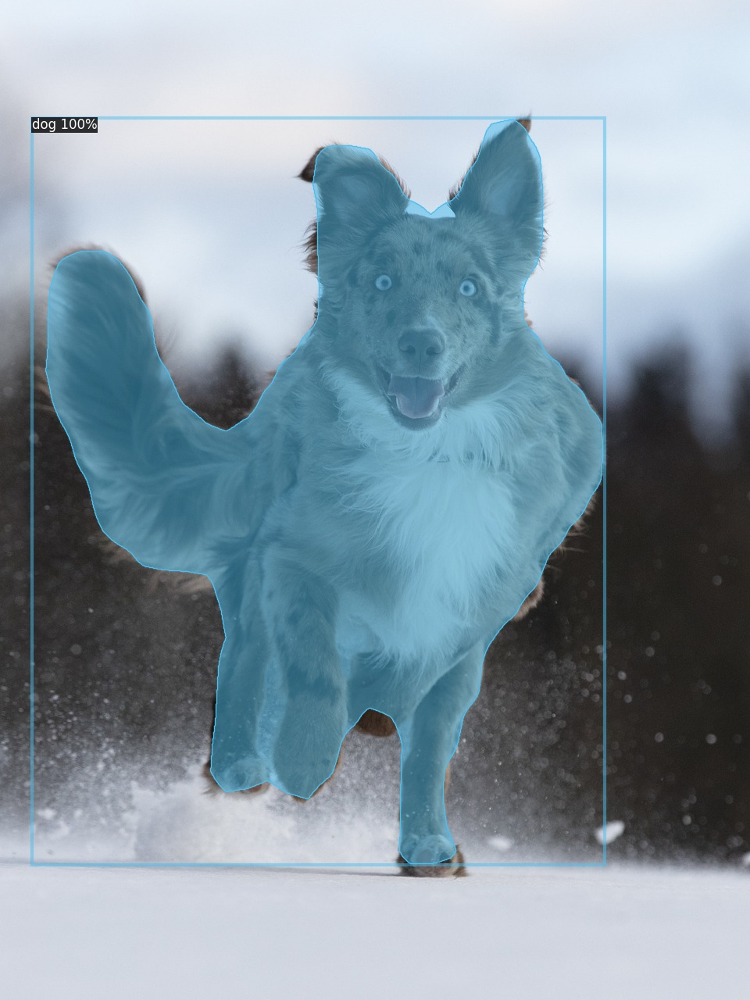
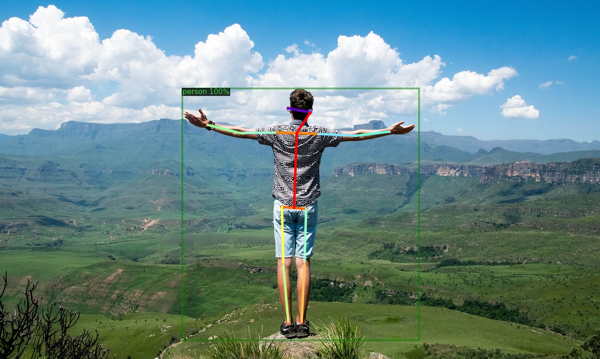
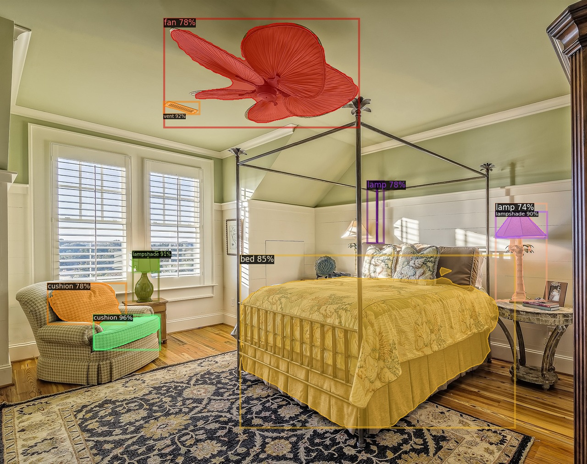
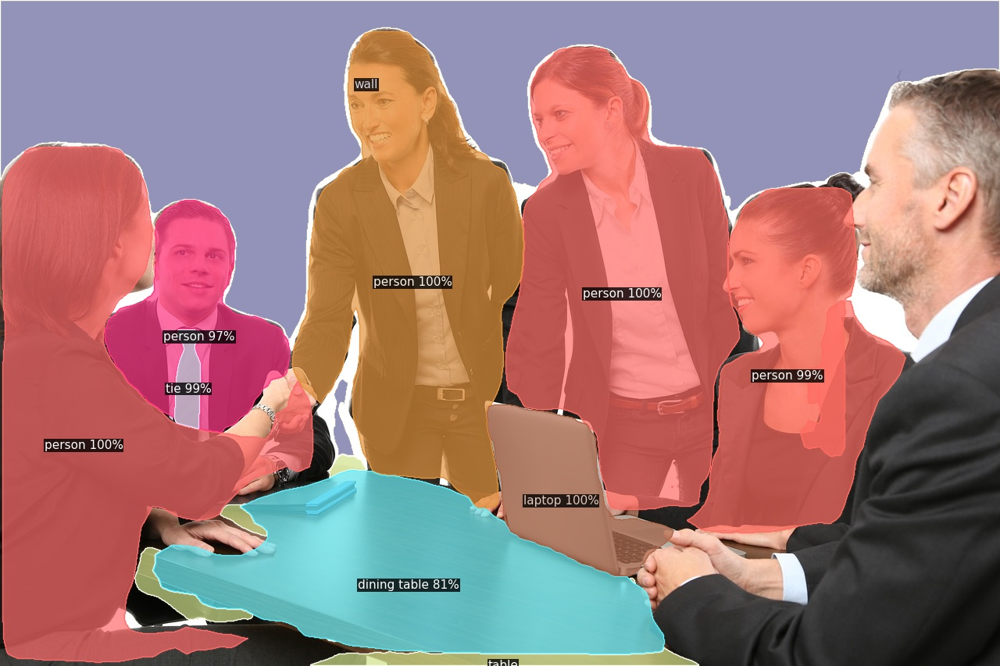

# Detectron2 Dockerfile


## Prerequisites
- Install [Docker](https://www.docker.com/).
- Ensure you have an NVIDIA GPU.

---

## Usage
### Clone the Repository
```sh
git clone https://github.com/michaelslice/detectron2_dockerfile.git
cd detectron2_dockerfile
```

### Prepare Your Data
Place the videos you want to process in the following directory:
```sh
detectron2_dockerfile/data
```

### Build the Docker Image
```sh
docker build -t <image-name> .
```

### Run the Docker Container
Run the container in interactive mode with GPU acceleration:
```sh
docker run -it --gpus all <image-name>
```

### Process Files in Interactive Mode
Inside the container, run the following command:
```sh
python3 validate_user.py /data/<file-to-be-processed>
```
You will be prompted to select a model and choose between image or video processing.

#### Model Options
- **Object Detection**: `OD`
- **Instance Segmentation**: `IS`
- **Keypoint Detection**: `KP`
- **LVIS Instance Segmentation**: `LVIS`
- **Panoptic Segmentation**: `PS`

#### Processing Options
- **Image**: `1`
- **Video**: `2`

---

## Output
The processed file will be renamed as:
```sh
<name>_processed<file-type>
```
and will be located in the `/data` directory inside the container.

### Retrieve Processed Files
1. Check the running containers:
   ```sh
   docker ps
   ```
2. Copy the processed files from the container to your local directory:
   ```sh
   docker cp <container-ID>:/data/<file-name>_processed.jpg $(pwd)
   ```

---

## Notes
- Replace `<image-name>` with your preferred image name.
- When copying files, use a separate terminal window. You **cannot** copy files in the terminal running the Docker container in interactive mode.

---

## Resources
- [Detectron2 GitHub](https://github.com/facebookresearch/Detectron2)
- [Detectron2 Model Zoo](https://github.com/facebookresearch/detectron2/blob/main/MODEL_ZOO.md)

# Processed Images and Model Examples

## **Object Detection**


## **Instance Segmentation**


## **Keypoint Detection**


## **LVIS Instance Segmentation**


## **Panoptic Segmentation**

